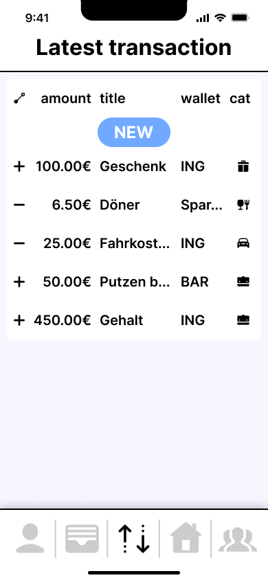
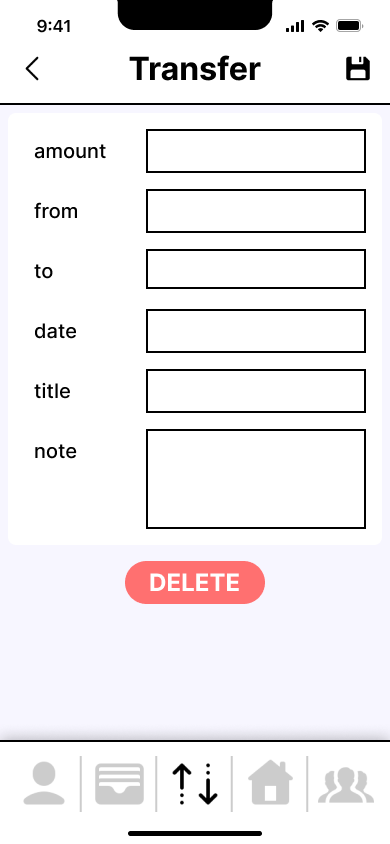
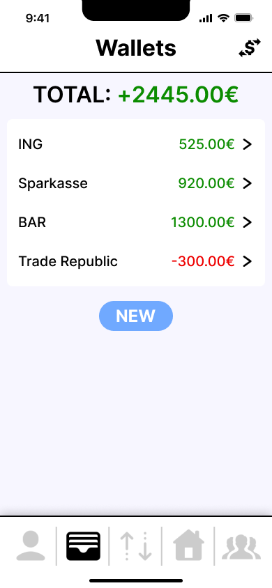
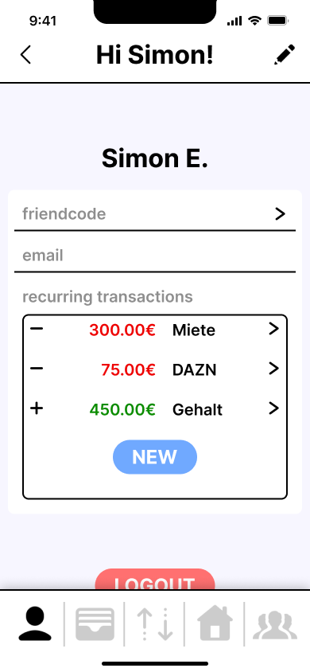
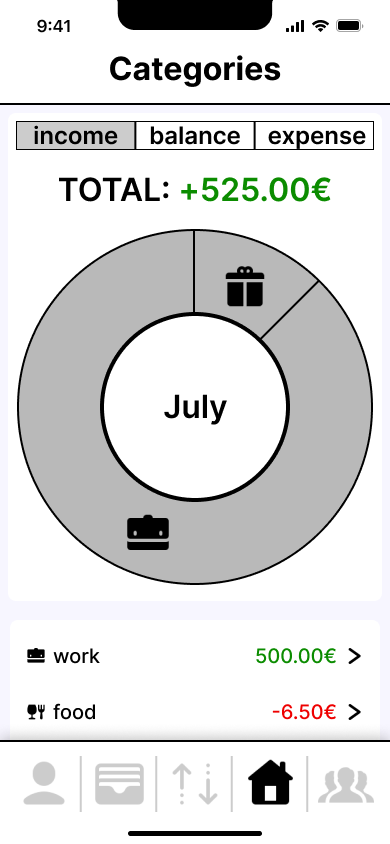
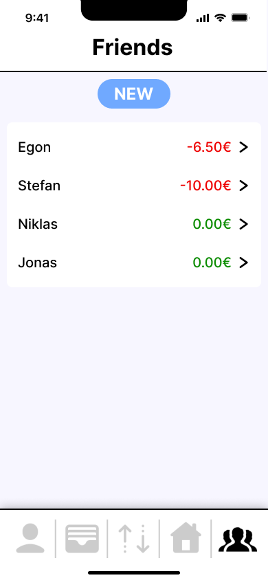
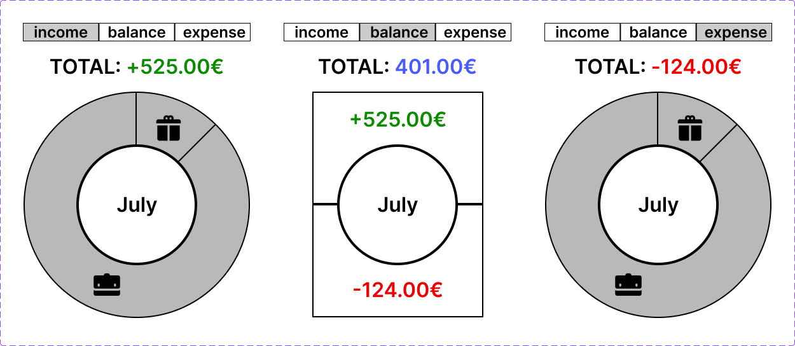

On this page, we will provide an overview of planed features for the CashCompass. The MockUps are mainly to assist understanding the functionality and not to give a 100% precise resemblance of what the app will look like when finished.
# Login and Sign Up tab:
## Login page

Login/SignUp page with option to navigate to SignUp/Login page for new users.
When the blue text is pressed the login field will switch between the two following:

LOGIN button starts login process where user is authenticated. SIGNUP button starts signup process where new user is added to authentication system.

User Stories: User Login, User registration
# Latest transactions tab:
Once logged in, the user is navigated to the latest transactions page.
## Latest transaction page

Transactions page, that shows list of the latest transactions with amount, title and category of each transaction and which wallet it belongs to. NEW button allows for creation of new transaction.

User stories: Create Transactions, Overview of latest transactions
## New transaction / Transaction detail page

New transaction page: Enter all details for a transaction. Depending on where you come from, the according information should be already filled in (wallet, category). All fields except note are mandatory.

User stories: Create transactions
***
Transaction detail page: View all the details of the transaction. When you click on the GEAR, the New transaction page will be visible.

User stories: Edit and delete transactions.
## Transfer page
Accessed via the trailing icon of the wallet page's title bar on the top, you can transfer money from one wallet to another with this page.

***missing desc***
# Wallets
The wallets tab displays transactions from the perspective of each transaction belonging to a certain wallet. A wallet refers to a bank account or trading portfolio.
## Wallets page

Wallet Overview Page, that provides a list of all wallets. NEW button creates new wallet. ARROW button navigates to Wallet page. Wallet can also contain stocks.

User stories: display wallets, wallet creation, view stocks
## Wallet detail page

Wallet Detail Page, that contains a list view from transaction page with just the selected wallet as well as balance of the wallet. The settings icon should lead to the edit/delete page of the wallet. The NEW button leads to the transaction create page.

User stories: edit and delete wallets, latest transactions, display wallets, create transactions
## Stock wallet detail page

***Missing desc***
## Stock detail page

***Missing desc***
## New wallet page

Wallet add page: Create a new wallet and enter all necessary information. Also its selectable whether this is a stock wallet. 
User stories: Create Wallets
# Account tab:
## Account page

Account page. LOGOUT button logs the user out. Friend code textfield provides friend code to be copied and ARROW button shows share-option (QR?).EDIT button changes page to edit page for username, mail and reset password.
Recurring transaction section presents all recurring transactions of the user, provides navigation to recurring transaction detail page via ARROW button and allows to create new recurring transaction via NEW button.

User stories: Recurring transactions, edit profile, delete account
## Recurring transaction page

Recurring transactions page: Used to create recurring transactions.
User stories: recurring transactions
# Categories tab:
The categories tab displays transactions from the perspective of each transaction belonging to a certain category. Apart from some technical categories categories are individual for every user.
## Categories overview page

Categories overview page displays all transactions summarized by each category in a pie chart (more detail on that at the end of this page) and a list. NEW button allows for creation of new categories. ARROW buttons navigate to selected category page.
Click on JULY to show a popup to change the date range. 

User stories: display categories, create categories, edit/ delete categories
## Category detail page

Category detail page shows all transactions belonging to selected category in a pie chart and a list. NEW button allows for creation of new transaction in this category. Click on JULY to show a popup to change the date range. Click on GEAR to get to detail page to edit and delete the category.

User stories: display categories, edit/delete categories
## New category / category edit page

Category add page: create a new category. If routed from an existing category, this is the edit page. It is deletable with a bin icon. 

User Stories: Create categories, edit and delete categories.

# Friends tab
## Friends overview page

Friends page shows all friends in a list. Click on NEW to add friends. Click on arrow to get to detail page. ***-6.50€ with Egon means, that the user paid 6.50€ for Egon and still has to get his money back.***

User stories: manage 
## Friend detail page

Friends detail page: Shows list of all transactions between you and your friend.
User story: Manage friends
IMPORTANT: This feature is in category "would" and it's implementation is still to be decided.

# Explanation of pie chart
To give the user an insight on his incomes and expenses we decided to use a chart oriented approach with three variants:

With the segmented control on the top the user can switch between the three variants. The first is a pie chart of all incomes in the selected interval, grouped by category or wallet (that depends on whether the pie chart is displayed on the category or wallet detail page).
The second variant is a plain comparison of all incomes and expenses in the selected interval.
The third variant displays all expenses of the selected interval in a pie chart similar to the incomes-variant.